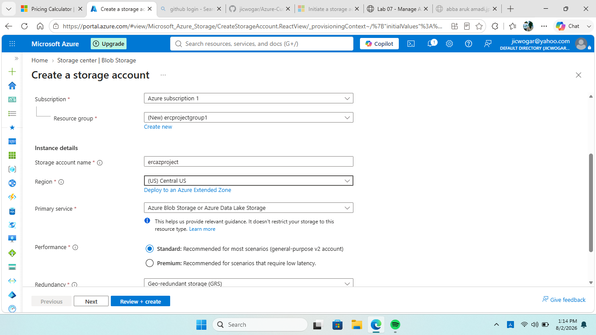
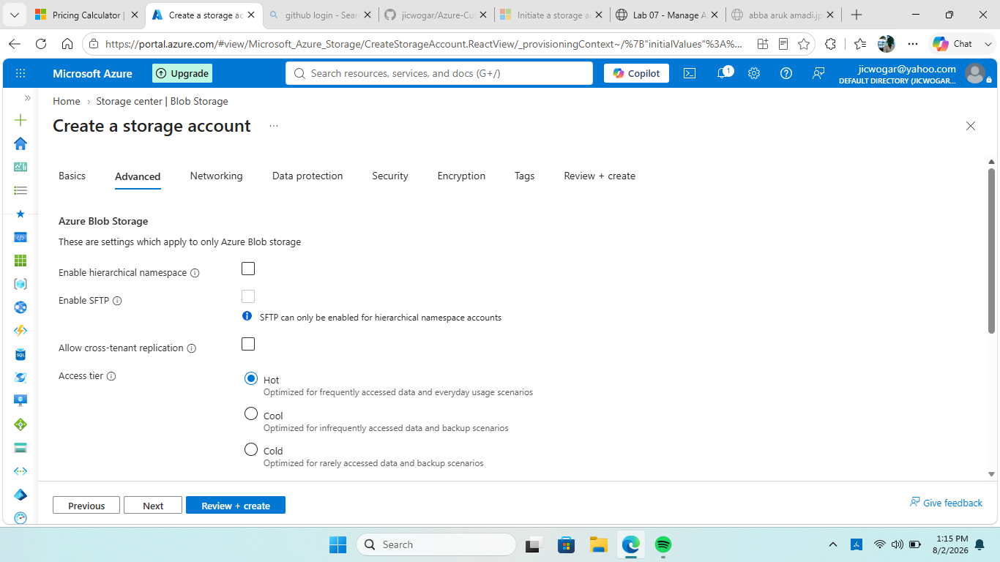
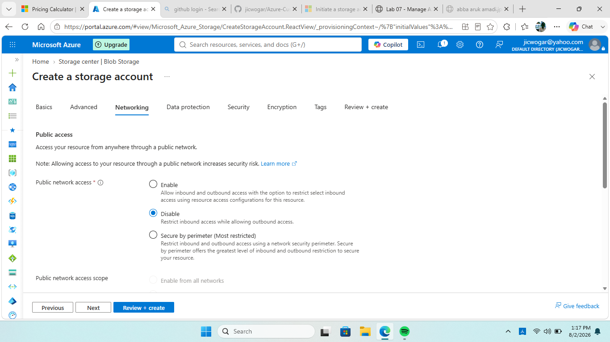
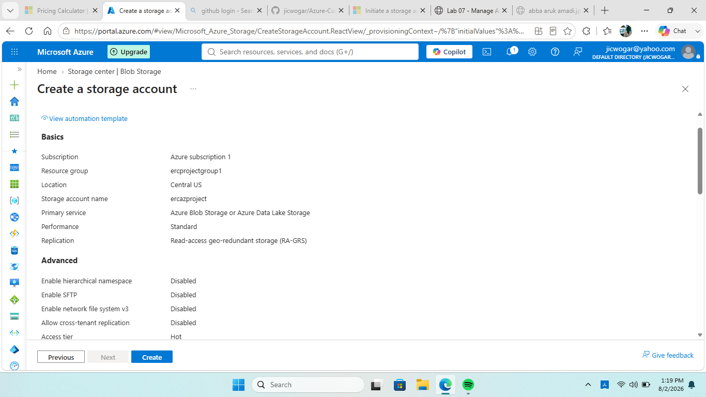
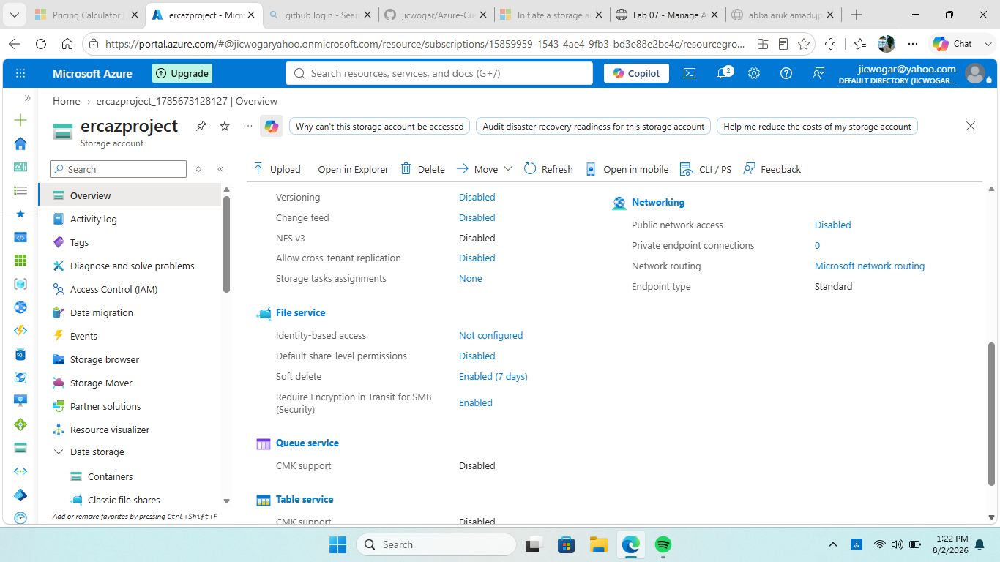

# Create and Configure an Azure Storage Account

## Project Overview

This project demonstrates the deployment, configuration, security hardening, data protection, networking, redundancy, and lifecycle management of an **Azure Storage Account** using the Azure Portal.

The project is documented step-by-step with screenshots and includes the architectural reasoning behind the major configuration decisions.

---

## Objectives

- Create and configure an Azure Storage Account.
- Select an appropriate performance and access tier.
- Configure storage redundancy.
- Configure public network access.
- Enable data-protection features such as soft delete.
- Review storage security and networking settings.
- Configure lifecycle management.
- Consider security, availability, performance, and cost.
- Document the implementation for portfolio demonstration.

---

## Technologies and Services

| Technology / Service | Purpose |
|---|---|
| Microsoft Azure | Cloud platform |
| Azure Storage Account | Blob/file/object storage |
| Azure Portal | Resource deployment and management |
| Storage redundancy | Resilience and availability |
| Storage access tiers | Cost optimization |
| Lifecycle management | Automated data-tier management |
| Azure networking controls | Network access control |
| Data protection | Protection against accidental deletion |

---

## Prerequisites

- Active Azure subscription
- Access to the Azure Portal
- Permission to create and manage storage accounts
- Basic understanding of Azure resource groups and storage services

---

# Implementation Steps

## Step 1 — Create a Standard Azure Storage Account

A new storage account was created through the Azure Portal.

### Key configuration areas

- Subscription
- Resource group
- Storage account name
- Region
- Performance
- Redundancy

### Architectural consideration

The storage configuration should be selected according to the workload rather than simply choosing the highest available option.

Performance, redundancy, availability requirements, and cost should all be considered before deployment.



---

## Step 2 — Configure the Access Tier

The storage access tier was configured from the Advanced configuration area.

Storage access tiers should reflect how frequently data is accessed.

### Architectural consideration

- **Hot** — frequently accessed data.
- **Cool** — infrequently accessed data.
- **Cold/Archive scenarios** — increasingly infrequent access where supported and appropriate.

Choosing the correct tier can reduce storage costs while maintaining suitable performance.



---

## Step 3 — Configure Networking and Public Network Access

The networking configuration was reviewed and public network access was restricted.

### Architectural consideration

Storage accounts can contain sensitive data. Restricting unnecessary public exposure reduces the attack surface.

For production workloads, consider:

- Selected networks
- IP restrictions
- Private Endpoints
- Microsoft Entra ID
- Azure RBAC
- Firewall rules



---

## Step 4 — Enable Data Protection

Soft delete was enabled from the Data Protection settings.

### Architectural consideration

Soft delete provides protection against accidental deletion and can support recovery from:

- User mistakes
- Accidental deletion
- Application errors
- Unintended administrative actions

Soft delete should complement, not replace, an appropriate backup and disaster-recovery strategy.


---

## Step 5 — Validate and Create

The configuration was validated before the storage account was created.

### Architectural consideration

Validation helps identify configuration problems before deployment and reduces the risk of creating resources with incorrect security, availability, or cost settings.



---

## Step 6 — Open the Deployed Resource

After deployment, the storage account was opened and the configuration was reviewed.

### Verification

- Confirm successful deployment.
- Review the resource overview.
- Verify the selected configuration.
- Review networking and security.
- Verify redundancy.


---

## Step 7 — Verify the Created Storage Account

The deployed storage account was reviewed in the Azure Portal.



---

## Step 8 — Review Security and Networking

The **Security + Networking** blade was reviewed.

### Architectural consideration

Security should be treated as a core architectural requirement.

Important controls include:

- Least-privilege access
- Microsoft Entra ID and Azure RBAC
- Restricted public access
- Private Endpoints where appropriate
- Encryption
- Monitoring and logging


---

## Step 9 — Restrict Public Network Access

Public network access was reviewed and restricted according to the intended security posture.

### Architectural rationale

Reducing unnecessary internet exposure lowers the attack surface.

A production architecture may use:

**Application → Private Endpoint → Azure Storage Account**

This provides private connectivity to the storage service.


---

## Step 10 — Verify Storage Redundancy

The configured redundancy setting was reviewed.

### Architectural consideration

Redundancy should be selected according to availability and disaster-recovery requirements.

| Option | General purpose |
|---|---|
| LRS | Replication within a single region |
| ZRS | Replication across availability zones |
| GRS | Replication to a secondary region |
| RA-GRS | GRS with read access to the secondary region |

Geo-redundancy can improve resilience against a regional outage, although replication to the secondary region is asynchronous.


---

## Step 11 — Configure Lifecycle Management

Lifecycle management was configured to support automated data management.

### Architectural consideration

Lifecycle rules can automatically transition or delete data according to defined conditions.

A typical strategy may be:

**Frequently accessed → Infrequently accessed → Archive → Delete**

This can reduce storage costs while retaining data according to business requirements.


---

# Architecture Considerations

### Security

Use least-privilege access and avoid unnecessary public exposure.

### Availability

Select redundancy according to workload availability and recovery requirements.

### Data Protection

Soft delete provides protection against accidental deletion but is not a complete disaster-recovery strategy.

### Cost Optimization

Access tiers and lifecycle management can reduce storage costs by matching storage configuration to actual data-access patterns.

### Operational Excellence

Validation, verification, monitoring, and documentation make cloud resources easier to operate and maintain.

---

# Production Security Recommendations

For a production environment, consider:

- Microsoft Entra ID and Azure RBAC instead of shared keys where practical.
- Least-privilege permissions.
- Private Endpoints for sensitive storage workloads.
- Restricted public network access.
- Appropriate logging and monitoring.
- Soft delete and other data-protection controls.
- Backup and disaster-recovery requirements.
- Regular configuration reviews.

---

# Infrastructure as Code — Future Improvement

This project was initially completed through the Azure Portal to demonstrate the configuration process.

The same architecture can subsequently be deployed using:

- ARM templates
- Bicep
- Terraform
- Azure CLI
- Azure PowerShell

Infrastructure as Code would make the deployment:

- Repeatable
- Version controlled
- Auditable
- Easier to reproduce
- Suitable for CI/CD

---

# Skills Demonstrated

- Azure Storage Accounts
- Azure Portal
- Storage redundancy
- Access tiers
- Azure networking
- Public network access controls
- Data protection
- Soft delete
- Lifecycle management
- Availability considerations
- Disaster-recovery concepts
- Cloud security
- Cost optimization
- Azure architecture
- Technical documentation

---

# Project Outcome

The Azure Storage Account was successfully created and configured with storage, networking, security, redundancy, data-protection, and lifecycle-management settings.

The project demonstrates both **hands-on Azure administration** and the ability to explain the **architectural reasoning behind cloud infrastructure decisions**.

---

## Important: Screenshot File Structure

The screenshots referenced above must be stored in the **same GitHub directory as this `README.md`**.

For example:

```text
Create-and-configure-an-Azure-storage-account/
├── README.md
├── 01-create-a-standard-azure-storage-account.png
├── 02-on-the-advanced-tab-select-the-hot-tier.png
├── 03-on-the-networking-tab-disable-public-access.png
├── 04-on-the-data-protection-tab-enable-soft-delete.png
├── 05-click-on-create-after-validation-is-complete.png
├── 06-go-to-resource-after-storage-is-completed.png
├── 07-created-storage-account.png
├── 08-Under-security-and-Networking-blade-select.png
├── 09-enable-public-access-for-selected-network.png
├── 10-Confirm-your-redundancy-settings-are-set-to-read-access.png
└── 11-Select-Lifecycle-management-and-add-a-rule.png
```

**Important:** GitHub filenames are case-sensitive. If your existing screenshot filenames are different, rename them to exactly match the names above, or change the image paths in this README to match your existing filenames.
